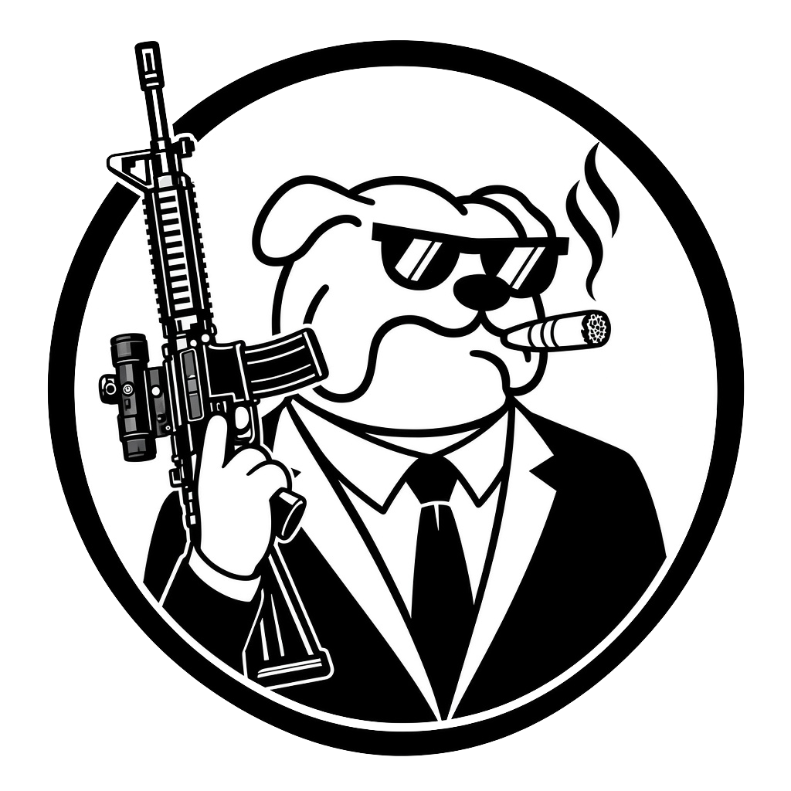
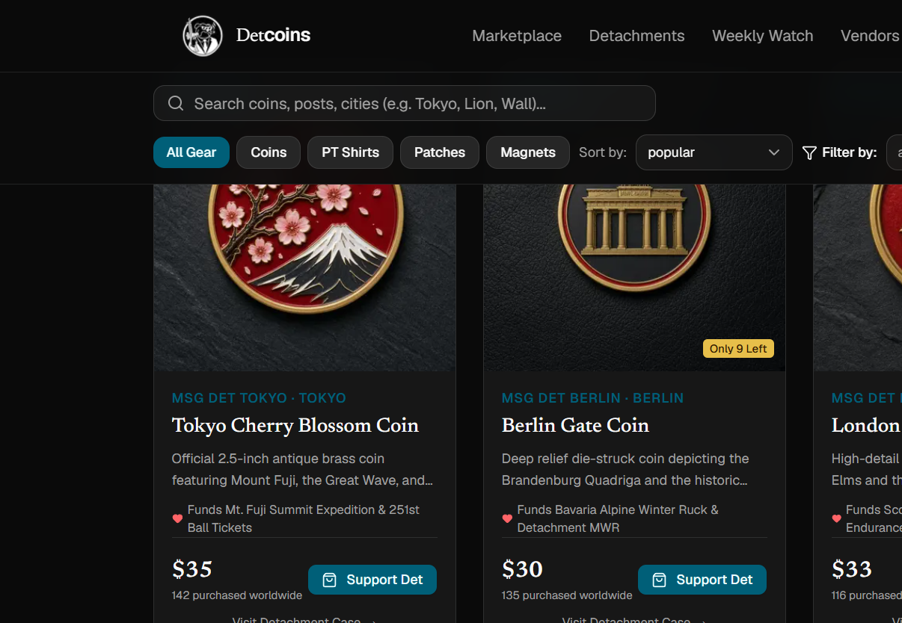
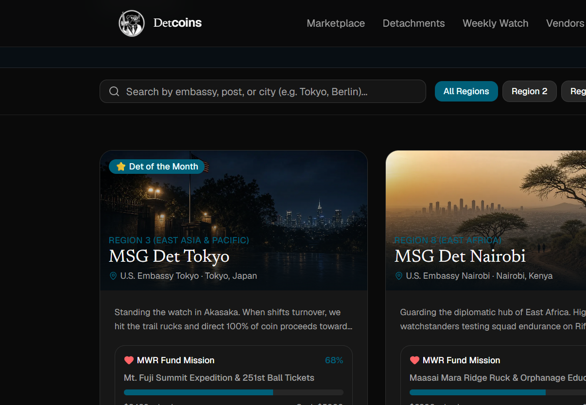
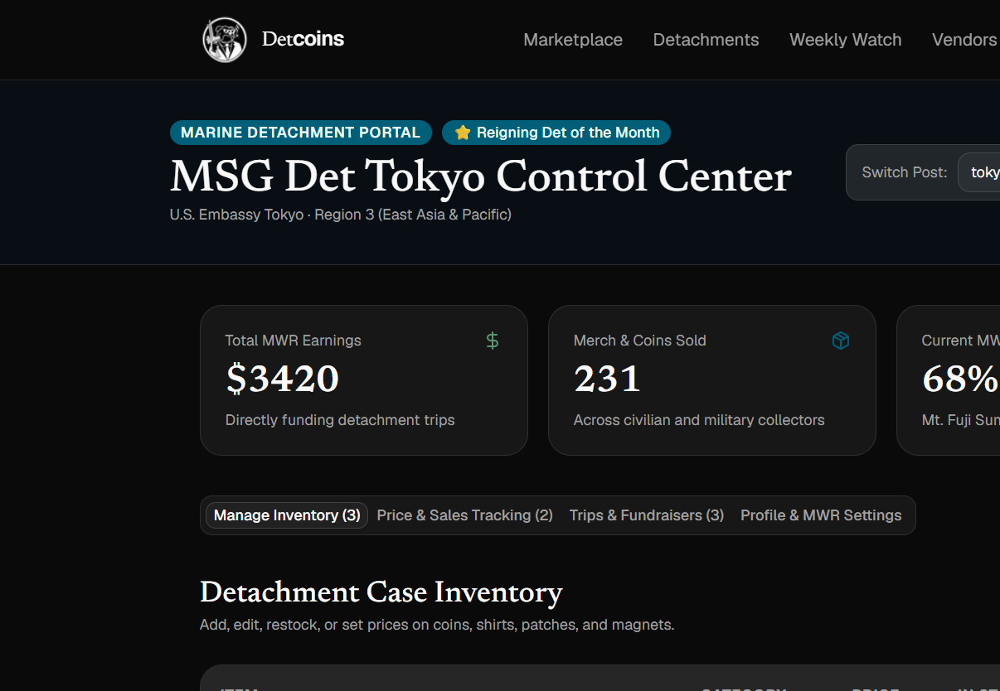
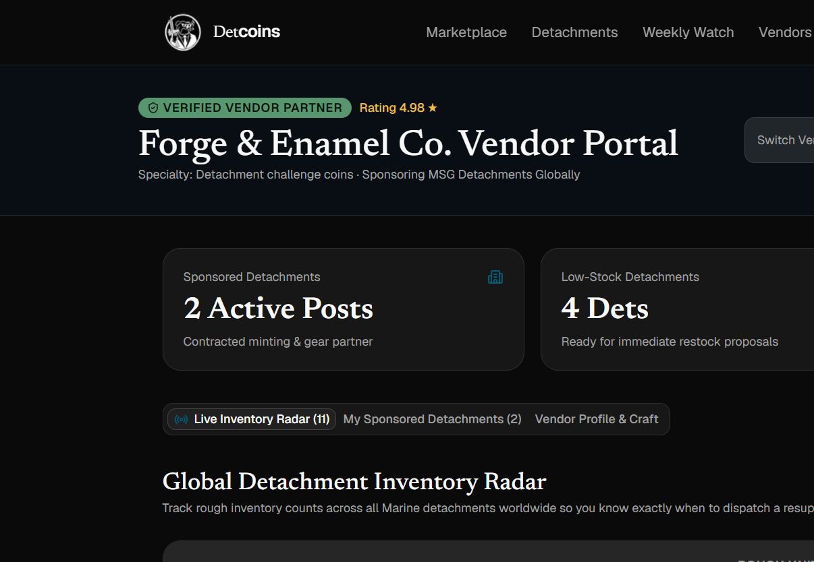

  <picture>
    <source media="(prefers-color-scheme: dark)" srcset="public/detcoins-logo-dark.png">
    
  </picture>

<h1 align="center">Detcoins</h1>

  <strong>A privately owned web marketplace for Marine Security Guard challenge coins and unit merch.</strong> 
  Civilians shop authentic coins from embassy posts worldwide. Marines run their case. Verified vendors keep it stocked. 100% of proceeds fund detachment MWR.

---

## Support the watch. Own the coin.

Marine Security Guards stand the rail at U.S. Embassies and Consulates around the world. Each detachment mints its own challenge coins, morale patches, and unit gear. Until now, those cases lived in a group chat, a barracks drawer, or a one-off Instagram post.

**Detcoins** is the hosted marketplace that opens that world in the browser:

- **Civilians and collectors** buy authentic, det-specific coins and send money straight back to the watchstanders.
- **Marines** run a public profile, list inventory, track MWR earnings, and compete for Det of the Month.
- **Verified vendors** watch global stock on a radar, then send resupply proposals before a det goes dry.

Every purchase is a vote for the det doing the work — rucks, balls, long weekends, and the unclassified stories that make the rest of the community proud.

---

## The marketplace

Shop coins, shirts, patches, and gear by embassy, region, or det. Search the catalog, filter by category, and buy in two clicks. Checkout names the MWR mission your order funds.

  

**How shopping works**

1. Open the **Marketplace** and filter by coins, shirts, patches, magnets, stickers, or gear.
2. Search by embassy, city, or det — Tokyo, Berlin, Nairobi, and the rest of the roster.
3. Hit **Support Det**. Checkout shows the item, quantity, shipping, and which MWR goal the sale funds.
4. Confirmation: *Semper Fi. Order placed to support the det.*

---

## Worldwide guard posts

The **Detachment Roster** is a living directory of Marine Corps Embassy Security Group posts. Search by embassy, city, or region, then open a public storefront.

  

**Each detachment page is a full storefront:**

- Immersive hero with post, city, country, and region
- Bio and Instagram handle
- **MWR fund progress** — goal title, dollars raised, percent to goal
- Shop the case by category (coins, shirts, patches, gear)
- Chronicle of funded trips (completed, upcoming, planning)
- Weekly Watch stories from that post
- Shareable profile link

Featured dets wear a **Det of the Month** badge and get front-and-center merch on the homepage.

---

## The Weekly Watchstander

Unclassified photos, video stills, and stories from dets doing cool stuff around the world. It is the community loop on Detcoins — and the contest that picks Det of the Month.

**Readers** scroll a magazine-style feed: det name, date, callsign, story, and a link back to that det’s case.

**Watchstanders** submit an unclassified adventure from the Weekly Watch or the Marine portal. Winning the month puts the det on the homepage hero and sponsors their merch front and center.

---

## For Marines

The **Marine Detachment Portal** is your post’s control center on Detcoins — inventory, earnings, trips, and the public profile, in one signed-in workspace.

  

---

## For verified vendors

The people who strike the coins, stitch the patches, and print the field frames. **Vendor Radar** shows every det’s inventory so partners can restock before a post goes dry.

  

Stock health on the radar:

- **Critical** — 10 or fewer left
- **Low** — 20 or fewer
- **Healthy** — keep the line moving

Verified partners send a **resupply proposal** (item type, batch size, notes) straight to the det’s control center.

Craft shops that already supply MSG dets can apply for a verified vendor seat at [hello@detcoins.com](mailto:hello@detcoins.com).

---

<em>Stand the watch. Shop the case. Keep the det moving.</em>

Detcoins is an independently owned and operated marketplace for MSG detachment merchandise and community storytelling. It is not an official U.S. Marine Corps, Marine Corps Embassy Security Group, Department of State, or U.S. government website.
